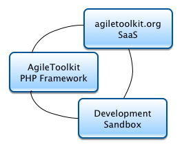

Agile Toolkit is a PHP framework for development of Web Application. It uses concepts from Mobile and Desktop toolkits for building Native HTML applications. Agile Toolkit has a strong philosophy and is driven by the key 5 principles: Simple, Advanced, Composite, Inherited and Agile.

Using Agile Toolkit will give you a consistent HTML/CSS-based interface out of the box, objects for UI widgets, Data Modeling tools, AJAX/jQuery integration, support for relational, NoSQL and RESTful data source with **minimum amount of code**.

Agile Toolkit is entirely driven by PHP language (except for templates) - no need to learn anything new. It has a very low entry barrier for beginners and is a great way to learn most popular web language - PHP.

If you use Agile Toolkit for your project, it will also promote consistent and readable code, making support and long-term projects highly cost-efficient. When you introduce a new experienced developer to your existing project, he will be able to track down and understand structure of your project almost instantly and perform critical changes without danger of breaking the project.

## Beyond PHP
Most of PHP framework focus on just being a framework, while Agile Toolkit takes it a step forward. It offers you the whole environment where you create, publish and deploy your web apps. All the services can be used by either a student who just starts to learn Web Development or a large corporation.

### AgileToolkit.org Services

Develop your project on your local computer and deploy it to the cloud with a single button-click. Agile Toolkit is the first web framework to come with intuitive and visual deployment mechanism.

### Free as a "speech"

Agile Toolkit framework is dual licensed - AGPL license gives you absolute freedom to use it free of charge within any project, as long as you offer the same freedom to the users of your software.

For developers looking to develop closed-source projects and deploy those to their own private servers a paid subscription will be required for the duration of your development cycle.

## Comparing Agile Toolkit

Agile Toolkit exists in a league of it's own. It is classified as a Web UI Framework, as it comes with it's own Web Interface, a modern CSS framework and a cloud service.

### Agile Toolkit for Web is like Xcode for Mobile

Agile Toolkit offers PHP developers a similar experience to Xcode by Apple for developing of iOS application.

* Both are free to download and use
* Both require to subscribe for commercial application deployment
* Both offer sophisticated framework (Cocoa and Agile Toolkit PHP)
* Both give you modern and fresh look
* Both focus on providing you, developer, with best tools to help you develop
* Both offer you a well-supported full-stack solution

### to other Open-Source web frameworks

A typical PHP framework offer you a narrow solution, require much higher knowledge, write more code, offer no user interface, does not encourage you to write Open-Source projects, does not offer free app hosting, offer no community portal yet very expressive commercial support and some even are designed to be "complex" or "slow" to drive additional commercial support or server-software sales.

Agile Toolkit is here to start a web revolution.