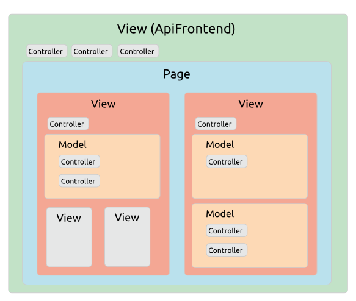
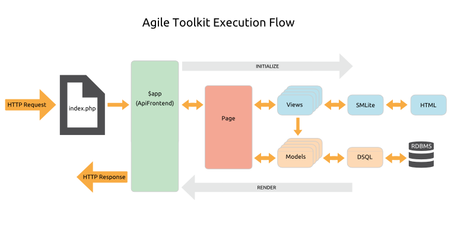

# Overview > Anatomy Of An Application

## The Class Hierarchy

To implement the [Composability](/TODO) and [Extensibility](/TODO) that make Agile Toolkit so productive we need to provide every object with a number of common features.

So at the top of the class hierarchy is `AbstractObject`, which primarily handles the creation, naming and initialization of objects.

As we've seen, there are three classes that extend directly from `AbstractObject`:

* **AbstractModel**: which adds features to help manage data entities
* **AbstractView**: which adds features for generating user interface output with nested templates
* **AbstractController**: which is the root class for all Controllers. 

All other classes descend from one of these three abstract classes.

## The Runtime Object Tree

In a related departure from conventional design, objects in Agile Toolkit are always instantiated inside a parent object using the `AbstractObject add()` method rather than the PHP `new` statement. Again, this is to assist with our Composability design goal. 

So an Agile Toolkit application is a runtime tree of objects nested inside other objects. 

Because of the focus on UI development, the application object at the top of the tree is a View, responsible for recursively rendering the output from all the child Views.

The Page View contains the top-level UI objects such as menus and tabs, and they contain more detailed Views such as forms, fields and buttons down as many levels of nesting as required. And within data-aware views like grids you'll find the necessary Models and Controllers.

When developing the UI, your primary task is to add the Views you need inside a parent View and associate them with the appropriate Model and any required Controllers. 

## The Application Object

As we've said, the topmost object in the Runtime Object Tree is your Application object `$api`, which is extended from an API class. Most of the Toolkit Core features are provided through this object. 

There are a number of API classes available in the Core, and you can extend them yourself to add any specific features you commonly require. The main Core APIs are:

* [ApiCLI](/TODO): a minimal frontend for command line requests
* [ApiWeb](/TODO): a minimal frontend for web applications, mainly used for integrating with other frameworks
* [ApiFrontend](/TODO): a comprehensive API for web applications, extending ApiWeb with routing, an integrated CSS styling system, and Page classes

There are other more specialized APIs for installers and REST requests.

API classes descend from `AbstractView`, because they are generally used to create output.

## The Execution Flow

Now you understand the Runtime Object Tree and the `$app` object we can walk though the basic anatomy of an HTTP request.

1. First, your webserver is configured to run the `index.php` file in your webroot for all page requests. This simply bootstraps your application with 3 lines of code:

    <pre>
    include 'atk4/loader.php';

    // Set up the application object
    $api=new Frontend('sample_project');

    // Run the application
    $api->main();
    </pre>
    
1. `Frontend.php` is the `$app` class, extended from the `ApiFrontend` API.

1. In `Frontend.php` you configure your class loading, initialize access security and add Controllers for application-wide functionality such as database access and logging.

1. The `$app` object will route the request to the correct Page class in your `/page` directory, throwing a 404 Page Not Found error if no matching page is found.

1. The Page will orchestrate the necessary top-level Views, and these will load any additional Views, Models and Controllers they require, recursively down the Runtime Object Tree.

1. Once all objects are initialized, the `$app` will recursively render the nested tree. Views use the SMlite template engine to generate their HTML output, and Models use the DSQL (Dynamic SQL) Query Builder to generate runtime SQL. 

1. Finally, the `$app` object will echo out the HTTP response as HTML, XML or whatever is required.

## The Application Core

The Agile Toolkit Core sits in the `/atk4` directory and handles the plumbing of your application. The key features are:

* [Configuration](/TODO): configuring the application and Controllers
* [Class Loading](/TODO): automatic lazy loading of classes as they are required
* [Request Routing](/TODO): loading the correct Page class to handle the request
* [Asset Management](/TODO): serving CSS, JavaScript, image and other media files
* [Event Hooks](/TODO): a callback mechanism for running code at specific points in the execution process
* [Authentication & Authorization](/TODO): controlling access to the application and its features
* [Error Handling](/TODO): help with handling and logging various types of error
* [Testing](/TODO): a simple but rather useful built-in unit testing framework.
