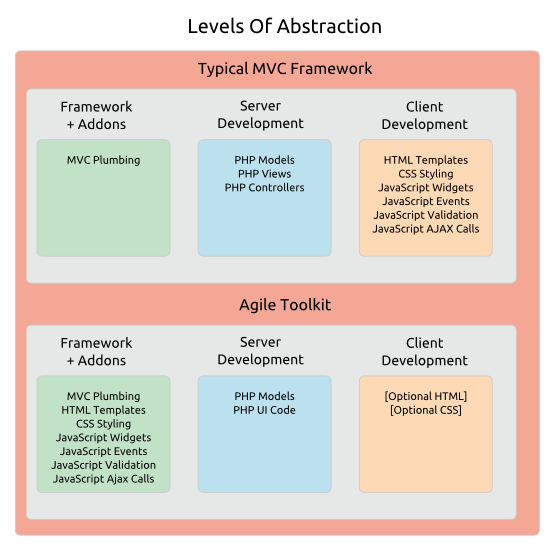

# Overview > Design Principles

## A Fresh Approach To Framework Design

New benefits require new approaches. The patterns we use in Agile Toolkit are widely used in desktop frameworks, but may be unfamiliar to web developers.

You'll find Agile Toolkit easier to learn if you understand the five key principles that have driven its design:

* The Abstraction Principle
* The Composability Principle
* The Extensibility Principle
* The Testability Principle
* The Simplicity Principle

## The Abstraction Principle

We abstract all the technologies of the client-side and the server-side behind a consistent PHP interface. You lay out your data entry system, define UI behaviour and handle client-side events using PHP on the server.

Years of experience with over 100 demanding Agile projects has proven that this radical level of abstraction shortens the learning curve, simplifies development and eases testing.

## The Composability Principle

The Toolkit is designed from the ground up to help developers compose reusable View components from smaller subcomponents. Powerful and flexible components speed development and increase reliability, and it's [Composability](http://en.wikipedia.org/wiki/Composability) that makes this possible.

Composability isn't restricted to View components &ndash; Models are composable too. So you can build complex queries from existing subqueries, expressions and field definitions.

Technically, Composability requires components that are independent, keep track of their own state and know how to cooperate with each other. Much of the design of Agile Toolkit is focused on offering these features transparently to every View and Model component, protecting the developer from the underlying complexities.

With Agile Toolkit you can quickly develop a range of flexible business and interface components to meet the repeating requirements of your problem domain.

## The Extensibility Principle

Composability is only the first step to a truly agile web framework. In many ways the toughest challenge is adding functionality to your components as your application evolves.

This is where you need [Extensibility](http://en.wikipedia.org/wiki/Extensibility) &ndash; the ability to add new functionality without breaking existing tested code.

To achieve Composability our Model and View objects store their parameters and only render output at the last moment, once they know what other objects they're working with. So all their settings can be changed at any stage before they render. This means that extended components can reconfigure any aspect of the parent and its subcomponents.

And Agile Toolkit gives you additional ways to extend your objects:

* Use call-backs (hooks) to inject event-aware code
* Inject new methods into any object at runtime with `addMethod()` or even into all objects simultaniously (as PHP5.5 traits do for classes)
* Replace standard classes with your own (so you can, for example, swap out the default `Grid` class in a `CRUD` View).

The Extensibility features in Agile Toolkit add agility to your development process.

## The Testability Principle

Agile development relies on testing, and testability has been a key consideration in the Toolkit's design.

Our focus on Composability and Extensibility means that everything in the Toolkit is an object &ndash; there's no use of static classes. And as we've seen every parameter in every object can be configured at runtime. So any component can be reconfigured or swapped out for testing with no special planning or setup.  

Agile Toolkit is a software tester's dream! 

## The Simplicity Principle

In addition to Abstraction and Composability our search for simplicity extends to the code itself. You'll find that the codebase is lean, the syntax is elegant and expressive, and the faff level is kept to a minimum. We prefer intuitive conventions to elaborate configuration. And we always adopt the simplest practical approach, even if it's not the 'purest' or trendiest. For example:

* Configuration settings are plain old PHP hashes, so if you want complex conditional configurations at runtime just pop in some code.
* You won't need namespacing when you're working with the Toolkit Core. This has never caused any practical problems and we avoid tedium like this:

    <pre><code>
    namespace Acme\TaskBundle\Controller;

    use Symfony\Bundle\FrameworkBundle\Controller\Controller;
    use Acme\TaskBundle\Entity\Task;
    use Symfony\Component\HttpFoundation\Request;
    </code></pre>

* We use directories in the file system to define our routes without complex configuration conventions, just as HTTP intended.

You'll find this kind of pragmatic thinking throughout the codebase. With Agile Toolkit you can just get on with the job without the framework getting in the way.
