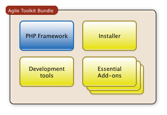
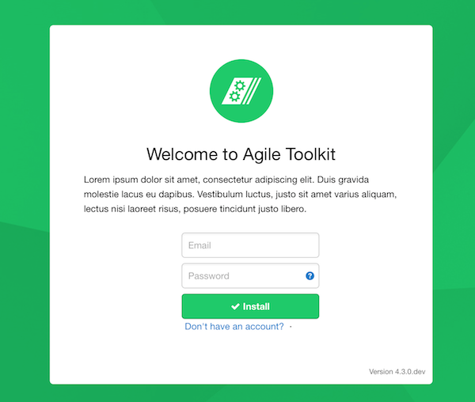

To build a web app using Agile Toolkit you will need to download a special "Agile Toolkit Developer Sandbox". It is a PHP application with installer which will help you through the application development process.

<a href="{page}download{/}" class="atk-button atk-swatch-yellow">Download Agile Toolkit 4.3</a>

Agile Toolkit is distributed as a PHP application. You must have latest PHP installed on your computer ([PHP Download link - look under Binaries section](http://uk1.php.net/downloads.php)). 

### What is inside that archive you have downloaded?

The PHP Framework is not an application on it's own. It helps you to build your application, the framework itself is just a blank page.

We don't want you to start with an empty blank page, that's why we included "Developer Sandbox" into this archive. It comes with "Installer", an easy step-by-step guide to configuring your new brand new app. Developer tools are also included to help you realize a full potential of Agile Toolkit.

## Run the installer

Find and execute file "**start.sh**" (or start.bat for Windows). This will attempt to start up PHP in server-mode and open a browser towards "Installer". If everything worked out OK, you should see this in the browser:

From here on you should just follow on-screen instructions. If it didn't work for you, then you'll need to continue with the manual installation below.

### Security Warning

The Sandbox mode of Agile Toolkit is designed to be executed on your local computer, which should be protected from public access. If you are willing to install your web application into **production environment**, you can do that with "Deploy to the Cloud" from inside your sandbox.

### Manual Installation

Manual installation instruction can be found under "Advanced Installation" article.

#### Possible Problems

If you are already running a web server (such as MAMP), then copy agiletoolkit folder inside your webroot, then locate the folder through the browser. 

The PHP must have write access to the folder. This is necessary to update configuration, install modules, themes etc.

Your PHP must have access to the internet. Agile Toolkit Developer tools will try to assist you with installing modules, themes which they download from www.agiletoolkit.org.

We recommend using [PHP Built-in web server](http://php.net/manual/en/features.commandline.webserver.php) for your local installation of Agile Toolkit, but never use it for production.