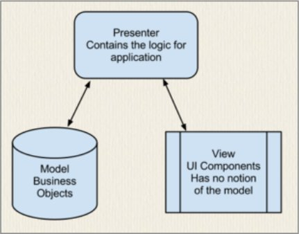
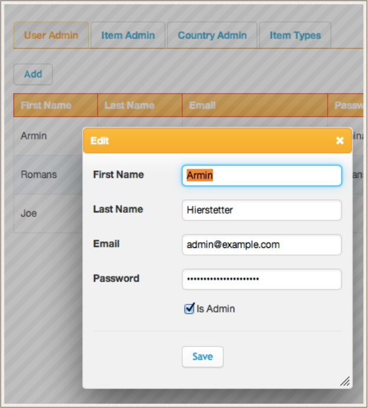

[Home](../readme.md "Home")

#### SECTION 2
----
## Inspiration for Agile Toolkit

Agile Toolkit draws it’s inspiration from a several non-PHP sources.

### jQuery

While many PHP has similarities to the JavaScript and Java libraries, the closest resembling framework for Agile Toolkit is jQuery. Advanced use of objects, short and concise syntax, heavy method overloading, philosophy, intuitive approach and even similar syntax brings both libraries close together.

    // jQuery Code
    $('li').hide().fadeIn();
    
    // Agile Toolkit - DSQL
    $name = $dsql->table('user')->field('name')->getOne();
    
    // Agile Toolkit jQuery Chain
    $form->getElement('name')->js('click')->val('');
    
    // Agile Toolkit Model
    $user->load(1)->set('name','John')->save();

### Desktop Toolkits

Agile Toolkit has a very strong User Interface framework. It based on the principles used by desktop object-oriented toolkits:

    // QT
    fileMenu = menuBar()->addMenu(tr("&File"));
    fileMenu->addAction(newAct);
    
    // Agile Toolkit
    $menu = $page->add('Menu');
    $menu->addMenuItem('Users');

Agile Toolkit also allows it's developers to easily breach gap between the browser and the server by automatically using AJAX for call-backs.

    // Agile Toolkit
    $button = $page->add('Button')->set('Delete');
    if($button->isClicked()){
        $model->delete();
        $this->js()->univ()->alert('Item Deleted')->execute();
    }

### Model-View-Presenter

Model-View-Presenter is a derivative of the MVC software pattern. The MVP is mostly used for building User Interfaces.

A good example in Agile Toolkit is the way how you use a **<u>form</u>**. You would need to have a three components:

**<u>Page</u>** is the type of object which receives control form the Application in response to the requested URL and is responsible for a single page of your web application.

**<u>Form</u>** is a class for displaying a generic form on a page. Finally a **<u>Model</u>** is a class representing a business object, such as “user”.
    $page->add('Form')->setModel('User');

### Window Systems

A typical desktop windowing systems consists of views. By definition a view is a region on the screen which can display itself. Often view would contain other views which it relies on when it's rendering time. A good example is a dialog box, which contains buttons.

Agile Toolkit relies on a similar concept in the way how it produces HTML and JavaScript. The
HTML for the application is recursively rendered by the page and all the views you would add to the page.

The screenshot here demonstrates a page containing Tabs which contains CRUD which contains Grid. When Edit button is clicked then a new window displays another Page containing Form which contains Fields and Button. All of the above is easily done by this code:

    $tabs = $this->add('Tabs');
    $tab = $tabs->addTab('User Admin');
    $user_crud=$tab->add('CRUD');
    $user_crud->setModel('User');

[Next Section](section3.md "Next Section")